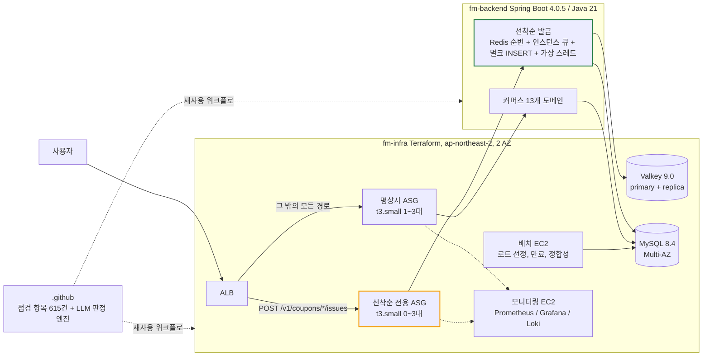

# Fresh Market

신선식품 자사몰. **대규모 트래픽 선착순 쿠폰 발급 시스템**이 이 프로젝트의 본론이다.

```
재고 10,000장 / 동시 요청 20,000명 / ramp-up 60초
  ->  초과 발급 0건 / 1인 1매 / 번호 유실 0 / p99 0.247초        2026-08-31, AWS 실측
```

Java 21 / Spring Boot 4.0.5 / MySQL 8.4 / Valkey(Redis) 9.0 / AWS (Terraform)
기간 2026-07-31 ~ 2026-08-31, 5명

---

## 왜 선착순 쿠폰인가

**신선식품은 안 팔리면 재고가 남는 것이 아니라 폐기가 된다.** 같은 상품이라도 입고 차수마다 소비기한이 다르고, 그 차이가 그대로 판매 가능 기간이 된다. 팀은 평상시에 로트 단위 재고를 소비기한 임박순(FEFO)으로 깎고, 이벤트에는 임박 재고를 떨기 위해 선착순 쿠폰을 연다.

```
배치가 임박순 -> 판매율 저조순으로 로트를 고른다   ->   그 로트가 30% 정률 할인 쿠폰의 대상이 된다
```

**재고 10,000장에 20,000명이 오면 절반은 반드시 못 받는다.** 그 절반을 어떻게 돌려보내느냐가 설계의 대부분을 정했다.

## 저장소 셋

| 저장소 | 언어 | 무엇 | 여기부터 |
|---|---|---|---|
| [fm-backend](https://github.com/fresh-market/fm-backend) | Java | 선착순 쿠폰 본론, 커머스 도메인 13개, 기능 명세 72개를 옮긴 32개 테이블 | [선착순 쿠폰 설계와 근거](https://github.com/fresh-market/fm-backend#5-선착순-쿠폰-설계와-근거) |
| [fm-infra](https://github.com/fresh-market/fm-infra) | HCL | Terraform 16파일 3,183줄, 운영 스크립트 13개, 부하 시험 회차 기록 7개 | [docs/system-design](https://github.com/fresh-market/fm-infra/tree/main/docs/system-design) 설계 근거 10개 |
| [.github](https://github.com/fresh-market/.github) | - | 세 저장소가 재사용 워크플로로 부르는 점검 항목 615건과 LLM 판정 엔진 | 아래 "기계가 먼저 보는 코드 리뷰" |

작업은 [프로젝트 보드](https://github.com/orgs/fresh-market/projects/6) 의 이슈에서 시작한다.

## 요구와 실측

| 항목 | 기준 | 실측 |
|---|---|---:|
| 초과 발급 | 0건 | **0건** |
| 1인 최대 | 1매 | **1매** |
| 번호 유실 | 0 | **0** |
| 발급 응답 p99 | 1초 이하. 팀이 스스로 건 SLO | **0.247초** |

**요구사항이 지연을 재지 않아서 팀이 SLO 를 하나 더 걸었다.** 팀은 그 한 줄에서 타임아웃 계층 전체를 역산했다.

* **정합성은 발급 이력 300만 건 전체를 대상으로 본다.** 팀은 재실행하면 같은 결과가 나오게 만들었고 더미 회원 100만 명 위에서 쟀다.
* **p99 를 가른 변수는 워밍업 하나였다.** 차가운 JVM 에서 4.69초, 워밍업 뒤 0.247초로 19배 차이다. 팀은 AWS 에서 한 번에 한 변수만 움직이며 19회차를 돌렸고 워밍업 말고는 구별되지 않았다.
* **장애 중에는 SLO 를 못 지켰다.** 팀이 캐시 페일오버를 주입한 회차에서 재고를 9,989장 내보내는 대신 p99 가 1.041초였다. 초과 발급은 앱 급사와 캐시 페일오버와 둘 동시, 세 회차 모두 0 이다.

**채택안은 v4 다.** Redis 순번, 인스턴스별 큐, 벌크 INSERT, 가상 스레드.

## 저장소 셋이 어떻게 닿나



**ALB 리스너 규칙이 발급 경로만 전용 ASG 로 가른다.** 평상시 앱과 인스턴스가 겹치지 않아 다른 기능의 성능에 영향이 없고, 잰 수치가 오직 발급 경로의 것이 된다.

## 기계가 먼저 보는 코드 리뷰

**저장소 셋이 같은 판정기를 부른다.** 점검 항목 615건은 품질 속성 219(ISO 25010 기반), 코드 관용 276, 인프라 제약 120 으로 나뉜다.

```
가이드 문서(사람이 쓴다) -> items.yml(gen_items.py 가 생성) -> anchors.yml(바뀐 파일이 켤 항목, 규칙 11개) -> run.py(실행기)
```

| 게이트 | 어디서 | 막나 |
|---|---|---|
| **G-BUILD** | Gradle, SonarQube | **막는다.** 결정론적이라 여기만 차단한다 |
| G-PR | CI 자동 | 안 막는다 |
| G-LOCAL | 개발자 로컬 | 안 막지만 결과가 저장소에 커밋되어 남는다 |

**팀은 LLM 게이트를 차단으로 두지 않았다.** 팀이 재현율을 재지 않았기 때문이다. 놓치는 비율을 모르는 채로 막으면 통과가 "문제가 없다" 가 아니라 "이번엔 못 찾았다" 인데도 사람이 통과를 믿게 된다.

## 팀

| 이름 | 맡은 영역 |
|---|---|
| [devjohnpark](https://github.com/devjohnpark) | 선착순 쿠폰 / 인프라 / 공통 모듈 / 코드 검증 시스템 |
| [muzimzz](https://github.com/muzimzz) | 회원 / 인증 / 주문 / 결제 / 장바구니 |
| [jaeungchoi](https://github.com/jaeungchoi) | 상품 / 옵션 / 상품 이미지 / 재고 |
| [gyudongjeong](https://github.com/gyudongjeong) | 관리자 계정 / 인증 / 감사 로그 |
| [taejoong15](https://github.com/taejoong15) | 재고(로트) / 캠페인 대상 / 상품 |
